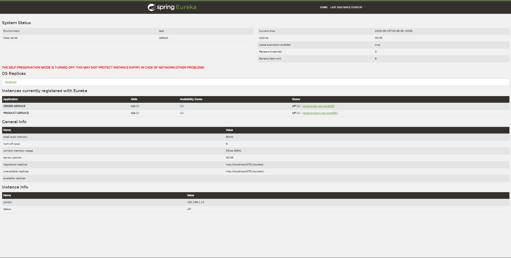
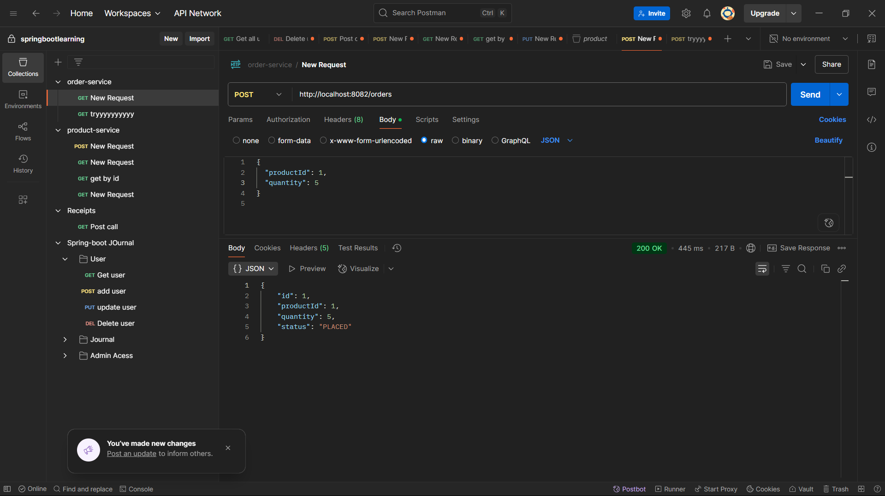

# Mini E-commerce System using Microservices

This project implements a mini e-commerce system using a microservices architecture with Spring Boot.

## 🧱 Services Overview

This system consists of the following microservices:

1.  **Eureka Server:**
    * Service registry for service discovery. All other services register with and discover each other through Eureka.
    * Port: `8761`
# Mini E-commerce System using Microservices

This project implements a mini e-commerce system using a microservices architecture with Spring Boot.

## 🧱 Services Overview

This system consists of the following microservices:

1.  **Eureka Server:**
    * Service registry for service discovery. All other services register with and discover each other through Eureka.
    * Port: `8761`

2.  **Product Service:**
    * Manages product information (CRUD operations).
    * Fields: `id`, `name`, `price`, `description`, `quantityAvailable`.
    * Initial product data is loaded on startup using `data.sql`.
    * Port: `8081`

3.  **Order Service:**
    * Handles placing orders and reducing product quantities.
    * Fields: `id`, `productId`, `quantity`, `status` (`PLACED`, `CANCELLED`).
    * Communicates with the Product Service via Feign Client for product availability checks and quantity reduction.
    * Includes basic fallback handling for Product Service calls.
    * Port: `8082`

## ⚙️ Tech Stack

* Java 17+
* Spring Boot 3.x
* Spring Data JPA
* Spring Cloud OpenFeign (for service-to-service calls)
* H2 (In-Memory Database for development)
* Maven (build tool)
* Git / GitHub

## 🚀 Setup Instructions

Follow these steps to set up and run the application on your local machine.

### Prerequisites

* Java Development Kit (JDK) 17 or higher
* Apache Maven (for building and running)
* A Git client

### Running the Services

1.  **Clone the Repository:**
    If you haven't already, clone this repository to your local machine:
    ```bash
    git clone [https://github.com/YOUR_GITHUB_USERNAME/your-repo-name.git](https://github.com/YOUR_GITHUB_USERNAME/your-repo-name.git)
    cd your-repo-name
    ```
    *(Replace `YOUR_GITHUB_USERNAME` and `your-repo-name` with your actual GitHub details).*

2.  **Build All Services:**
    Navigate to the root of the monorepo (`your-repo-name`) and build all projects using Maven:
    ```bash
    mvn clean install
    ```
    This will compile the code and package each service into a JAR file in its respective `target` directory.

3.  **Start Eureka Server:**
    * Open a new terminal window.
    * Navigate to the `eureka-server` directory:
        ```bash
        cd eureka-server
        ```
    * Run the Spring Boot application:
        ```bash
        mvn spring-boot:run
        ```
    * Wait for the Eureka Server to start up. You should see "Started EurekaServerApplication" in the logs. Eureka dashboard will be accessible at `http://localhost:8761`.

4.  **Start Product Service:**
    * Open another new terminal window.
    * Navigate to the `product-service` directory:
        ```bash
        cd product-service
        ```
    * Run the Spring Boot application:
        ```bash
        mvn spring-boot:run
        ```
    * Wait for the Product Service to start and register with Eureka. It will load initial product data (see Example API flows).

5.  **Start Order Service:**
    * Open a third new terminal window.
    * Navigate to the `order-service` directory:
        ```bash
        cd order-service
        ```
    * Run the Spring Boot application:
        ```bash
        mvn spring-boot:run
        ```
    * Wait for the Order Service to start and register with Eureka.

### Verifying Service Registration (Optional)

Once all services are running, you can visit the Eureka dashboard in your web browser:
`http://localhost:8761`
You should see `PRODUCT-SERVICE` and `ORDER-SERVICE` listed as registered applications.

## 🔄 Example API Flows

You can interact with the services using tools like `curl`, Postman, or Insomnia.

### 1. Product Service (`http://localhost:8081`)

* **Get All Products (GET /products):**
    Initial products are loaded from `data.sql` on startup.
    ```bash
    curl http://localhost:8081/products
    ```
    *Example Response (might vary based on your `data.sql`):*
    ```json
    [
        {"id":1,"name":"Laptop","description":"Powerful computing machine","price":1200.0,"quantityAvailable":100},
        {"id":2,"name":"Mouse","description":"Ergonomic computer mouse","price":25.0,"quantityAvailable":250}
    ]
    ```

* **Get Product by ID (GET /products/{id}):**
    ```bash
    curl http://localhost:8081/products/1
    ```
    *Example Response:*
    ```json
    {"id":1,"name":"Laptop","description":"Powerful computing machine","price":1200.0,"quantityAvailable":100}
    ```

* **Create a Product (POST /products):**
    Send this JSON as the request body.
    ```json
    {
        "name": "Mechanical Keyboard",
        "price": 75.00,
        "description": "Clicky RGB keyboard",
        "quantityAvailable": 50
    }
    ```

### 2. Order Service (`http://localhost:8082`)

* **Place an Order (POST /orders):**
    This will call the Product Service to check availability and reduce quantity.
    ```json
    {
        "productId": 1,
        "quantity": 2
    }
    ```
    Send this JSON as the request body to `http://localhost:8082/orders`.
    *Example Success Response:*
    ```json
    {"id": <generated_id>, "productId": 1, "quantity": 2, "status": "PLACED"}
    ```
    *(Note: If product quantity is insufficient, you will receive an error like "Not enough quantity available").*

* **Get All Orders (GET /orders):**
    ```bash
    curl http://localhost:8082/orders
    ```
    *Example Response:*
    ```json
    [
        {"id": 1, "productId": 1, "quantity": 2, "status": "PLACED"}
    ]
    ```

## 🖼️ Screenshots of Services Running

Below are screenshots demonstrating the successful startup of all three microservices.

### Eureka Server Running


### Product Service and Order Service Running


## 📁 Repository Structure
2.  **Product Service:**
    * Manages product information (CRUD operations).
    * Fields: `id`, `name`, `price`, `description`, `quantityAvailable`.
    * Initial product data is loaded on startup using `data.sql`.
    * Port: `8081`

3.  **Order Service:**
    * Handles placing orders and reducing product quantities.
    * Fields: `id`, `productId`, `quantity`, `status` (`PLACED`, `CANCELLED`).
    * Communicates with the Product Service via Feign Client for product availability checks and quantity reduction.
    * Includes basic fallback handling for Product Service calls.
    * Port: `8082`

## ⚙️ Tech Stack

* Java 17+
* Spring Boot 3.x
* Spring Data JPA
* Spring Cloud OpenFeign (for service-to-service calls)
* H2 (In-Memory Database for development)
* Maven (build tool)
* Git / GitHub

## 🚀 Setup Instructions

Follow these steps to set up and run the application on your local machine.

### Prerequisites

* Java Development Kit (JDK) 17 or higher
* Apache Maven (for building and running)
* A Git client

### Running the Services

1.  **Clone the Repository:**
    If you haven't already, clone this repository to your local machine:
    ```bash
    git clone [https://github.com/YOUR_GITHUB_USERNAME/your-repo-name.git](https://github.com/YOUR_GITHUB_USERNAME/your-repo-name.git)
    cd your-repo-name
    ```
    *(Replace `YOUR_GITHUB_USERNAME` and `your-repo-name` with your actual GitHub details).*

2.  **Build All Services:**
    Navigate to the root of the monorepo (`your-repo-name`) and build all projects using Maven:
    ```bash
    mvn clean install
    ```
    This will compile the code and package each service into a JAR file in its respective `target` directory.

3.  **Start Eureka Server:**
    * Open a new terminal window.
    * Navigate to the `eureka-server` directory:
        ```bash
        cd eureka-server
        ```
    * Run the Spring Boot application:
        ```bash
        mvn spring-boot:run
        ```
    * Wait for the Eureka Server to start up. You should see "Started EurekaServerApplication" in the logs. Eureka dashboard will be accessible at `http://localhost:8761`.

4.  **Start Product Service:**
    * Open another new terminal window.
    * Navigate to the `product-service` directory:
        ```bash
        cd product-service
        ```
    * Run the Spring Boot application:
        ```bash
        mvn spring-boot:run
        ```
    * Wait for the Product Service to start and register with Eureka. It will load initial product data (see Example API flows).

5.  **Start Order Service:**
    * Open a third new terminal window.
    * Navigate to the `order-service` directory:
        ```bash
        cd order-service
        ```
    * Run the Spring Boot application:
        ```bash
        mvn spring-boot:run
        ```
    * Wait for the Order Service to start and register with Eureka.

### Verifying Service Registration (Optional)

Once all services are running, you can visit the Eureka dashboard in your web browser:
`http://localhost:8761`
You should see `PRODUCT-SERVICE` and `ORDER-SERVICE` listed as registered applications.

## 🔄 Example API Flows

You can interact with the services using tools like `curl`, Postman, or Insomnia.

### 1. Product Service (`http://localhost:8081`)

* **Get All Products (GET /products):**
    Initial products are loaded from `data.sql` on startup.
    ```bash
    curl http://localhost:8081/products
    ```
    *Example Response (might vary based on your `data.sql`):*
    ```json
    [
        {"id":1,"name":"Laptop","description":"Powerful computing machine","price":1200.0,"quantityAvailable":100},
        {"id":2,"name":"Mouse","description":"Ergonomic computer mouse","price":25.0,"quantityAvailable":250}
    ]
    ```

* **Get Product by ID (GET /products/{id}):**
    ```bash
    curl http://localhost:8081/products/1
    ```
    *Example Response:*
    ```json
    {"id":1,"name":"Laptop","description":"Powerful computing machine","price":1200.0,"quantityAvailable":100}
    ```

* **Create a Product (POST /products):**
    Send this JSON as the request body.
    ```json
    {
        "name": "Mechanical Keyboard",
        "price": 75.00,
        "description": "Clicky RGB keyboard",
        "quantityAvailable": 50
    }
    ```

### 2. Order Service (`http://localhost:8082`)

* **Place an Order (POST /orders):**
    This will call the Product Service to check availability and reduce quantity.
    ```json
    {
        "productId": 1,
        "quantity": 2
    }
    ```
    Send this JSON as the request body to `http://localhost:8082/orders`.
    *Example Success Response:*
    ```json
    {"id": <generated_id>, "productId": 1, "quantity": 2, "status": "PLACED"}
    ```
    *(Note: If product quantity is insufficient, you will receive an error like "Not enough quantity available").*

* **Get All Orders (GET /orders):**
    ```bash
    curl http://localhost:8082/orders
    ```
    *Example Response:*
    ```json
    [
        {"id": 1, "productId": 1, "quantity": 2, "status": "PLACED"}
    ]
    ```

## 🖼️ Screenshots of Services Running

Below are screenshots demonstrating the successful startup of all three microservices.

### Eureka Server Running


### Product Service and Order Service Running


## 📁 Repository Structure
